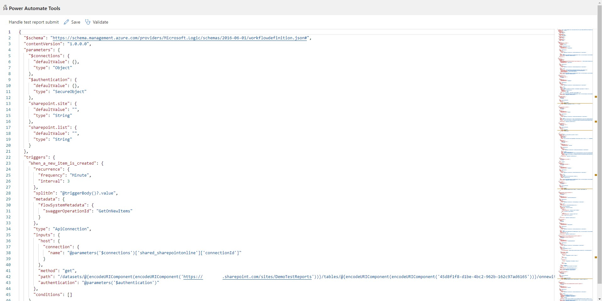

# Power Automate Tools Extension

The Chrome/Edge extension enables editing a Power Automate flow definition as JSON.

## Motivation

The reason behind creating this extension is constantly struggling with repetitive tasks in the flow authoring workflow like replacing a SharePoint site's URL or changing the variable name.

## Features

- Edit a Power Automate flow as JSON in your browser.
- Workflow definition JSON schema validation.
- Rich text manipulation features thanks to [Monaco Editor (VS Code)](https://microsoft.github.io/monaco-editor/).
- Validating actions using "Flow Checker".
- More features may come in the future :)

## Getting started

1. Get the extension from the [Chrome extensions store](https://chrome.google.com/webstore/detail/power-automate-tools/jccblbmcghkddifenlocnjfmeemjeacc) or [Edge Add-ons](https://microsoftedge.microsoft.com/addons/detail/power-automate-tools/ecdclfoojhebjoknjoooljcakfbfpjoj)
2. Open the flow edit page in the Power Automate portal.
3. Click the extension icon.
4. Edit your flow!

## Troubleshooting

If the extension doesn't work, try these steps:

### Extension icon is grayed out
- Make sure you're on a Power Automate flow page
- Navigate to the flow details or edit page
- Refresh the page and wait for it to fully load
- The extension needs to detect API calls to activate

### "Please refresh the flow's details/edit tab first" message
- Go to your Power Automate flow
- Click on the flow to open it
- Navigate to any tab within the flow (Overview, Run history, Edit, etc.)
- Wait for the page to fully load
- Try clicking the extension icon again

### "Connecting to Power Automate..." takes too long
- Refresh the Power Automate page
- Make sure you're logged in to Power Automate
- Try opening a different flow first, then return to your target flow
- Check that you have the necessary permissions to view/edit the flow

### Authentication errors
- Click the "Refresh Token" button in the extension
- If that doesn't work, refresh the Power Automate page
- Make sure your Power Automate session hasn't expired
- Try logging out and back into Power Automate

### Saving fails
- Check that you have edit permissions for the flow
- Ensure the JSON is valid (no syntax errors)
- Make sure all required properties are present
- Try refreshing your authentication token

### General tips
- Always keep the Power Automate tab open while using the extension
- Don't navigate away from the flow page while editing
- Save your work frequently
- If problems persist, try restarting your browser

## Change Log

### v1.2
- Fixed the issue of saving a flow
- Support for launching from the new Power Automate designer
- Improved launching from the Power Apps Portal
- Now the editor allows to edit the flow definition and connection references

### v1.1

Added support for opening a flow from the new Power Automate portal and Power Apps portal.

## Known limitations

- The authentication token is not refreshed automatically at this moment. Sometimes might be necessary to refresh the flow page that was used to open the extension.
